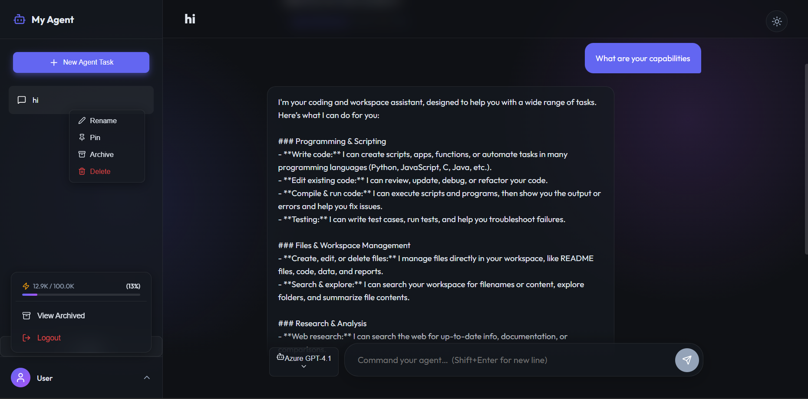
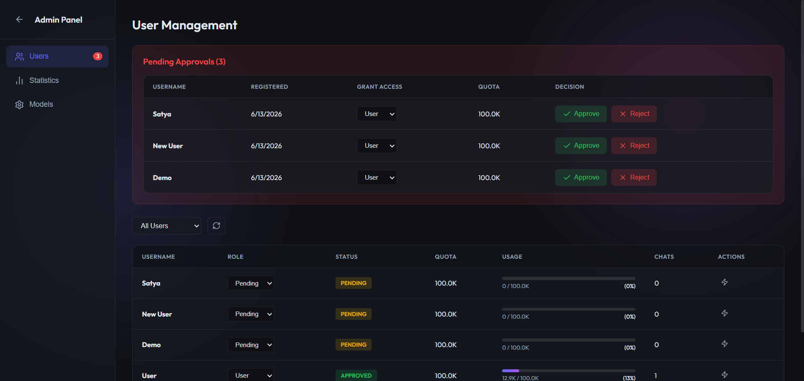
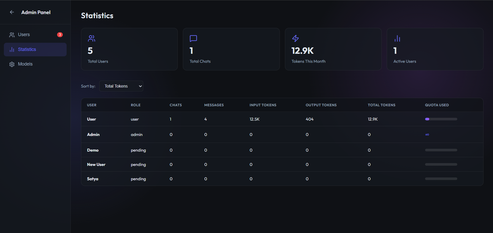
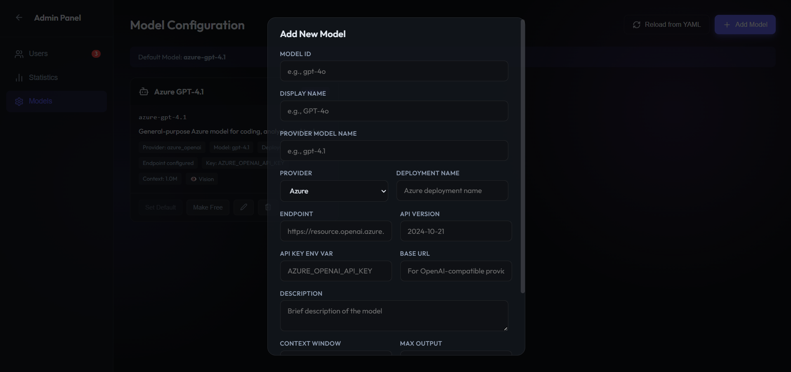

# LangChain ChatBot

A multi-user AI workspace with streaming chat, tool use, generated files,
conversation history, model selection, token quotas, and an admin console.

## What Users Can Do

- Register and wait for an administrator to approve the account.
- Chat with the configured AI models and switch models per request.
- Review tool activity and approve sensitive actions.
- Reopen conversation history and download generated files.
- See monthly token quota and usage information.

Administrators can approve or reject registrations, assign `user`, `admin`, or
`disabled` access, change quotas, review usage statistics, and manage model
configuration. Disabled accounts cannot sign in and are asked to contact an
administrator.

Every self-registration starts as `pending`. During approval, an administrator
chooses whether to grant User or Admin access. Admin accounts have unlimited
monthly token quota.

## Screenshots



The chat workspace combines model selection, token quota visibility, conversation management, and streaming agent responses.



The Users view lets administrators approve or reject registrations, grant access levels, manage roles, and monitor individual quotas.



The Statistics view summarizes system activity and provides per-user chat, message, token, and quota metrics.



The Models view manages provider models, Azure deployments, endpoints, credentials, capabilities, tiers, and the default fallback model.

## Run Locally

Requirements:

- Python 3.12+
- Node.js 20+
- `uv`
- PostgreSQL for durable agent memory, or SQLite/in-memory persistence for
  local evaluation

1. Configure `backend/.env`. At minimum, provide database and model-provider
   credentials.
2. Copy `backend/app/models.yaml.example` to
   `backend/app/models.yaml`, then set model IDs, deployments, endpoints, and
   API-key environment variable names.
3. Start the backend:

```powershell
cd backend
uv sync
uv run main.py
```

4. Start the frontend in another terminal:

```powershell
cd frontend
npm install
npm run dev
```

5. Open `http://localhost:5173`. The API runs at
   `http://localhost:8000`.

The initial administrator is created from `ADMIN_USERNAME` and
`ADMIN_PASSWORD`. Change the development defaults before exposing the app.

## Model Configuration

Secrets belong in `backend/.env`, not YAML:

```env
AZURE_OPENAI_ENDPOINT=https://your-resource.openai.azure.com
AZURE_OPENAI_API_KEY=...
OPENAI_API_KEY=...
```

Reference the key by environment-variable name:

```yaml
models:
  azure-gpt-4.1:
    name: Azure GPT-4.1
    provider: azure_openai
    model: gpt-4.1
    deployment: your-deployment-name
    endpoint: ${AZURE_OPENAI_ENDPOINT}
    api_version: "2024-10-21"
    api_key_env: AZURE_OPENAI_API_KEY
    enabled: true
```

See [backend/README.md](backend/README.md) and
[frontend/README.md](frontend/README.md) for developer details.
